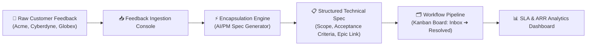

# PulseBoard — Enterprise Customer Feedback & Spec Workflow
## Executive Demo Guide & Walkthrough Script

> [!NOTE]
> **PulseBoard** is an enterprise-grade customer feedback and spec workflow platform designed for Product Management, Customer Engineering, and Support teams. It bridges the gap between unstructured high-value enterprise customer feedback and structured, developer-ready technical specifications.

---

## 🏛️ System Architecture Overview



---

## 🎭 Demo Personas & Roles

PulseBoard includes pre-configured demo personas to demonstrate role-based access control (RBAC) and team workflows:

| Persona | Role | Key Capabilities | Best Demo Use Case |
| :--- | :--- | :--- | :--- |
| **Elena Rostova** | Principal Product Manager | Encapsulate feedback, assign Jira Epics, transition stages, view analytics | **Main Demo Driver** — Encapsulation & Spec creation |
| **Marcus Vance** | Senior Enterprise Support Lead | Triage feedback, log customer tickets, add support comments | Customer escalation & initial triage flow |
| **Dr. Evelyn Sterling**| VP of Customer Engineering (Admin) | Full admin access, fast-track workflow, override SLA, manage roles | Admin governance & high-ARR executive overview |
| **David Chen** | VP Technology (Acme Financial) | Customer Rep — Submit feedback, view account status | End-customer feedback submission flow |

---

## 🎬 Step-by-Step Demo Walkthrough Script

### Step 1: Enterprise SSO & Persona Authentication
1. Launch the application (running on `http://localhost:5173`).
2. Notice the **Monochromatic Enterprise Dark / Light Mode** theme options.
3. Select **Elena Rostova (Principal Product Manager)** from the preset persona tiles.
4. Click **Sign In to Workflow Console** (simulating SAML 2.0 Federated SSO authentication).

> [!TIP]
> You can switch active demo personas at any time using the quick persona dropdown in the top-right of the header bar!

---

### Step 2: Module 1 — Feedback Ingestion Console
*Navigation: Click **Feedback Ingestion** tab in the top header.*

- **Overview**: View all inbound enterprise customer requests categorized by priority (`P0_CRITICAL` to `P3_LOW`), customer tier (`ENTERPRISE_VIP` to `SMB`), and SLA status.
- **Key Metrics Bar**:
  - Total Active Feedback items.
  - Active SLA Breaches.
  - Monitored ARR Impact (e.g., **$4.85M ARR**).
- **Interactive Features**:
  - Filter by Priority (`P0 Critical`), Customer Tier (`ENTERPRISE_VIP`), or Stage.
  - Search by code (e.g. `FB-8901`) or keyword (`SSO`, `Rate Limiting`).
  - Observe real-time SLA status badges: **SLA Active** vs **SLA Breached**.

---

### Step 3: Module 2 — Encapsulation Engine (The Core Feature)
*Navigation: Click **Encapsulation Engine** tab or click **Encapsulate** on any raw item (e.g. `FB-8901`).*

1. Locate item **FB-8901** (*SAML 2.0 Identity Provider Timeout on Multi-Tenant SSO Federation* submitted by *Acme Financial - $1.2M ARR*).
2. Click **Encapsulate into Spec**.
3. **The Encapsulation Wizard Opens**:
   - **Step 1: Core Problem & Revenue Impact**: Review raw complaint vs parsed problem statement and ARR at risk.
   - **Step 2: Technical Scope & Architecture**: Review generated technical scope items (e.g., Redis-backed sliding window rate limiter, SAML token persistence).
   - **Step 3: Acceptance Criteria & Jira Link**: Define acceptance criteria and link to target Jira Epic (e.g., `EPIC-SEC-108`).
4. Click **Generate & Save Technical Specification**.
5. Observe the spec confidence score (**94% - 98% Fit Confidence**) and auto-transition to `encapsulated` stage!

> [!IMPORTANT]
> Encapsulation prevents product clutter by converting vague complaints into unambiguous engineering requirements with clear acceptance criteria before entering the developer backlog.

---

### Step 4: Module 3 — Enterprise Workflow Pipeline (Kanban Board)
*Navigation: Click **Workflow Pipeline** tab in the header.*

- **Kanban Columns**: `Inbox` ➔ `Triaged` ➔ `Encapsulated` ➔ `Backlog` ➔ `In Progress` ➔ `Resolved`.
- **Drag-and-Drop / Action Transitioning**:
  - Move **FB-8902** (*REST API Rate Limiting*) from `Encapsulated` to `In Progress`.
  - Notice the automated audit log entry generated immediately.
- **Card Highlights**:
  - Priority badges (`P0 CRITICAL`, `P1 HIGH`).
  - Customer ARR tag (`$2.4M ARR`).
  - SLA deadline timer countdown.

---

### Step 5: Item Audit Trail & Customer Detail Drawer
1. Click on any feedback card or row to open the **Feedback Details Drawer**.
2. **Review the Tabs**:
   - **Overview**: View original customer quote, customer SLA tier, tags, and assigned persona.
   - **Technical Specification**: Inspect the full encapsulated spec, technical scope list, and acceptance criteria.
   - **Audit Trail**: View immutable system audit logs recording every action, actor name, timestamp, and stage change.
   - **Team Discussion**: Add comments as the active persona.

---

### Step 6: Module 4 — SLA & Analytics Dashboard
*Navigation: Click **SLA & Analytics** tab in the header.*

- **Compliance Gauges**: Real-time SLA compliance percentage (e.g., **80.0% Compliant**).
- **ARR at Risk Breakdown**: Revenue distribution across Customer Tiers (`ENTERPRISE_VIP`, `ENTERPRISE`, `MID_MARKET`).
- **Category Health Matrix**: Feedback volume & breach rate across Security/Compliance, Performance, API Integration, and Analytics.

---

### Step 7: Module 5 — System Audit Log
*Navigation: Click **Audit Log** tab in the sidebar (visible to users with `VIEW_AUDIT_LOGS` permission).*

- **Live Event Table**: Chronological, paginated list of every system event — newest first.
- **Event types captured**:
  - 🔐 **AUTH** — `LOGIN` and `LOGOUT` events with actor name, role, and timestamp.
  - 📋 **FEEDBACK** — `CREATE_FEEDBACK`, `UPDATE_FEEDBACK`, `STAGE_CHANGED`, `ENCAPSULATED`, `DELETE_FEEDBACK`.
  - 👤 **USER** — `CREATE_USER`, `UPDATE_USER` events with who made the change.
  - 💬 **COMMENT** — `COMMENT_ADDED` events on feedback items.
- **Filters**:
  - Search by actor name, action type, or details text.
  - Filter by category (Auth, Feedback, User Management, System).
  - Filter by specific action type.
- **Pagination**: 25 events per page with total count display.
- **Refresh**: Click **Refresh** to pull the latest events at any time.

---

## 🛠️ Demo Submission Test (Live Interactive Flow)

To perform a complete live end-to-end demonstration during a presentation:

1. Click **+ New Feedback** in the header.
2. Select Account: **Acme Global Financial ($1.2M ARR)**.
3. Select Category: **SECURITY_COMPLIANCE**.
4. Set Priority: **P0_CRITICAL**.
5. Enter Title: `Custom Audit Log Export for SOC2 Compliance Audit`.
6. Enter Raw Feedback: `Our security auditor requires automated daily CSV delivery of all admin privilege grants to an encrypted S3 bucket.`.
7. Click **Submit Feedback Entry**.
8. Notice how the system automatically calculates a **4-Hour SLA Deadline** based on Acme's `ENTERPRISE_VIP` tier!
9. Immediately encapsulate the newly created item into a technical spec and transition it on the Kanban board!

---

## ⚙️ Key Technical Highlights for Evaluators

- **UI Framework**: React 19 + TypeScript + Vite.
- **Styling**: Monochromatic CSS token design system with dark/light mode switching (`data-theme="dark|light"`).
- **Layout Architecture**: Flexbox layout with strict `flex-shrink: 0` bounds and hidden overflow navigation to ensure zero UI collisions across viewports.
- **Type Safety**: Strictly typed domain model (`FeedbackItem`, `EncapsulatedSpec`, `UserPersona`, `AuditLog`).

---

## 🔐 Recent Security, Auth & RBAC changes (implemented)

This release includes several security and access-control improvements. Use this section for demo talking points and operational commands.

1. Password policy (user creation/update only)
   - Enforced rule: mixed-case letters + at least one special character + minimum 16 characters.
   - Regex (backend): /^(?=.*[a-z])(?=.*[A-Z])(?=.*[^A-Za-z0-9]).{16,}$/
   - The login endpoint intentionally returns a generic error message: "Please check your username and password" (no policy details exposed).

2. Secure session handling
   - Cookies: httpOnly access_token (short TTL) and refresh_token (longer TTL) set by the server.
   - Endpoints:
     - POST /api/auth/login — sets cookies and returns profile
     - POST /api/auth/refresh — issues new access_token and returns profile
     - POST /api/auth/logout — revokes refresh token and clears cookies
   - Frontend uses fetch(..., { credentials: 'include' }) and restores session on App mount by calling /api/auth/refresh.

3. No hard-coded admin password in repo
   - DEFAULT_ADMIN_PASSWORD removed from committed files and code no longer contains a fallback secret.
   - Automated seeding/reset only runs when DEFAULT_ADMIN_PASSWORD is explicitly provided in the environment (not recommended for prod).
   - Admin helper added: [backend/setAdminPassword.mjs](C:/Users/ramit/OneDrive/Desktop/proj1/Customer-feedback-encapsulation-workflow-system/backend/setAdminPassword.mjs)
     - Interactive mode: node backend\\setAdminPassword.mjs (prompts to enter & confirm password)
     - Random generation: node backend\\setAdminPassword.mjs --random (prints password once)
   - Admin password checker updated: [backend/checkAdminPassword.mjs](C:/Users/ramit/OneDrive/Desktop/proj1/Customer-feedback-encapsulation-workflow-system/backend/checkAdminPassword.mjs)
     - Now requires PASSWORD_TO_TEST env var; no fallback password.

4. RBAC enforcement
   - Backend enforces permission checks via middleware (see [backend/server.js](C:/Users/ramit/OneDrive/Desktop/proj1/Customer-feedback-encapsulation-workflow-system/backend/server.js)).
   - Permissions stored per-user as JSON (users.permissions) and include `FULL_ADMIN_ACCESS` for admin.
   - Frontend gating via [frontend/src/utils/permissions.ts](C:/Users/ramit/OneDrive/Desktop/proj1/Customer-feedback-encapsulation-workflow-system/frontend/src/utils/permissions.ts).

5. CORS and environment variables
   - Backend reads FRONTEND_ORIGIN from environment (added to backend/.env for development): FRONTEND_ORIGIN=http://localhost:5173
   - For production, also set JWT_SECRET and enable Secure cookies + trust proxy settings.

6. UI updates (visible during demo)
   - Left "New Feedback" action removed from the Sidebar; top-right "Ingest New Feedback" remains.
   - Bottom lock control replaced with a Logout action (icon + "Logout" text) that calls the logout endpoint and returns to login.
   - Light-mode near-black colors changed to slate grey (#374151) via [frontend/src/index.css](C:/Users/ramit/OneDrive/Desktop/proj1/Customer-feedback-encapsulation-workflow-system/frontend/src/index.css).

---

## ▶️ How to run (developer / demo)

1. Ensure required environment variables (local dev):
   - FRONTEND_ORIGIN=http://localhost:5173
   - DB connection vars: DB_HOST, DB_USER, DB_PASSWORD, DB_NAME
   - (Optional) DEFAULT_ADMIN_PASSWORD only if you intentionally want automated seeding (not recommended)
   - For production: set JWT_SECRET and configure Secure cookies + trusted proxy.

2. Create or reset admin securely (recommended):
   - Interactive:
     node backend\\setAdminPassword.mjs
   - Generate a strong random admin password and show it once:
     node backend\\setAdminPassword.mjs --random

3. Start backend and frontend (Windows examples):
   - CMD (open two new command windows):
     start "Backend" cmd /k "cd backend && npm run dev" & start "Frontend" cmd /k "cd frontend && npm run dev"
   - PowerShell (open two new PowerShell windows):
     Start-Process -FilePath 'powershell' -ArgumentList '-NoExit','-Command','cd backend; npm run dev'; Start-Process -FilePath 'powershell' -ArgumentList '-NoExit','-Command','cd frontend; npm run dev'

4. Demo flow:
   - Open the frontend at http://localhost:5173
   - Login with admin (created in step 2)
   - Refresh the page — session is preserved via httpOnly cookies and the refresh endpoint (no tokens in localStorage).
   - Use User Management to create/update users (password policy enforced on create/update only) and assign roles/permissions.

---

## ✅ Current Application Behavior

### Authentication and user identity

The application uses the backend login and registration APIs. A successful login creates
httpOnly access and refresh cookies; the frontend does not store JWTs in localStorage.
Refreshing the browser restores the session through `POST /api/auth/refresh`.

Use real database users for the demo rather than relying on the old mock-persona wording
above. A typical demo setup is:

| Demo user | Role | Expected result |
| :--- | :--- | :--- |
| `prat1` | `CUSTOMER_REP` | Can submit feedback and see only feedback submitted by `prat1` |
| Admin account | `ENTERPRISE_ADMIN` | Can manage users, inspect all feedback, view audit logs, and use admin workflow permissions |

The password policy for registration and user creation/update is at least 16 characters
with uppercase, lowercase, and a special character. Never place demo passwords in this
guide or commit them to the repository.

### Customer Representative feedback isolation

Feedback ownership is enforced on the backend, not only in the UI:

1. When a user submits feedback, the backend records the authenticated user's ID in
   `feedback.submittedById`.
2. `CUSTOMER_REP` requests to `GET /api/feedback` are filtered by that ID.
3. A customer representative cannot update another user's feedback through
   `PUT /api/feedback/:id`.
4. The Feedback Ingestion card displays the submitter in the **Logged by** field.

The `submittedById` column is added automatically for existing MySQL databases when the
backend starts. Existing seed records may have no owner ID and therefore are intended for
administrative views; new customer submissions are owner-linked.

### Theme behavior

The initial theme follows the browser/operating-system `prefers-color-scheme` setting.
After a user explicitly switches Light/Dark, the preference is saved in the user's
`settings` JSON column:

```text
users.settings = { "theme": "light" | "dark" }
```

The preference is updated through the authenticated `PATCH /api/auth/preferences`
endpoint and is restored on the next login or session refresh. If saving fails, the
frontend reverts to the previous theme and logs the error.

### Fixed navigation layout

The application shell uses a fixed viewport-height layout. The sidebar, current-user
identity, theme control, and Logout action stay in place while only the main feedback
content pane scrolls. This prevents the sidebar controls from moving out of view when
many feedback cards are loaded.

### Feedback email notifications

Registration email delivery uses SendGrid from `backend/emailService.js`.

Required configuration:

```env
SENDGRID_API_KEY=<restricted SendGrid API key>
SENDGRID_FROM_EMAIL=<verified Sender Identity>
```

The `SENDGRID_FROM_EMAIL` address must be verified in SendGrid or domain-authenticated.
SendGrid returning HTTP `202 Accepted` means the request was accepted for delivery; the
recipient should also check spam/junk folders. Revoke any API key that has been exposed
and never commit API keys to source control.

---

## 🐳 Cloud VM Docker Deployment

The deployment files are in the [docker](./docker) directory. The stack contains:

- `frontend`: Vite production build served by Nginx on port 80.
- `backend`: Node.js/Express API on the internal Docker network at port 5000.
- `db`: MySQL 8.4 with persistent volume storage.
- Nginx proxying `/api/*` requests to the backend service.
- `traefik`: public HTTP/HTTPS entrypoint with automatic Let's Encrypt certificates.

The application currently uses MySQL (`mysql2`), not PostgreSQL. The MySQL database/schema
name defaults to `feedback_encapsulation_db`.

### First deployment

On the VM, from the repository root:

```bash
cd docker
cp .env.example .env
```

Edit `docker/.env` and set unique production values for:

```env
DB_PASSWORD=<strong application database password>
DB_ROOT_PASSWORD=<different strong root password>
JWT_SECRET=<long random secret>
APP_DOMAIN=feedback.yourdomain.com
ACME_EMAIL=admin@yourdomain.com
FRONTEND_ORIGIN=https://feedback.yourdomain.com
SENDGRID_API_KEY=<restricted key, optional>
SENDGRID_FROM_EMAIL=<verified sender, optional>
ADMIN_NOTIFICATION_EMAIL=<admin email, optional>
```

Start the stack:

```bash
docker compose up -d --build
docker compose ps
docker compose logs -f backend
```

Before starting the stack, create a DNS `A` record that points
`feedback.yourdomain.com` to the VM public IP. Allow inbound TCP ports 80 and 443 in
the cloud firewall. Open `https://feedback.yourdomain.com` after the certificate is
issued. Traefik redirects HTTP traffic to HTTPS and renews the certificate automatically.

The database data is stored in the `mysql_data` Docker volume and survives container
recreation. Do not publish MySQL port 3306 publicly unless there is a specific operational
requirement.

Traefik stores the ACME account and certificate data in the persistent
`letsencrypt_data` volume. Use secure secret storage on the VM or cloud secret manager
instead of committing `docker/.env`.

### Useful Docker operations

```bash
docker compose logs -f
docker compose restart backend
docker compose exec db mysql -u"$DB_USER" -p"$DB_PASSWORD" "$DB_NAME"
docker compose down
```

Do not run `docker compose down -v` unless database data should be permanently deleted.

---

## ✅ Notes & Recommendations
- Replace in-memory refresh token store with Redis or DB for production to support revocation across instances.
- Never commit passwords to source control. Use a secret manager or secure CI pipeline to set DB seeds if needed.
- Consider adding a small `backend/.env.example` (without secrets) to document required env vars.

If you'd like, I can append a short section showing example SQL to create a manual admin user, or add a `backend/README.md` with the same run steps.
